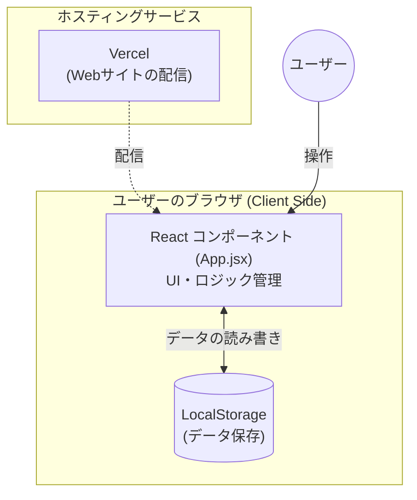
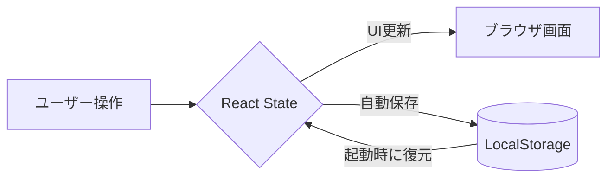
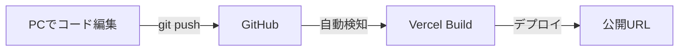
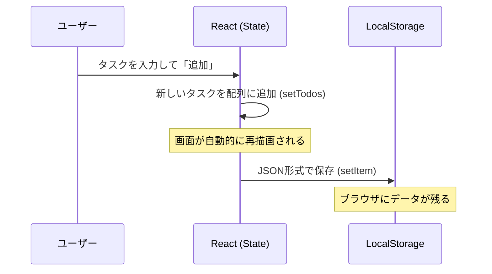

Markdown形式の説明書（`.md`ファイル）を作成しました。図解にはMermaid記法を使用し、視覚的に構造を理解しやすい構成にしています。

---

```python
from ds_python_interpreter import execute

# Markdownの内容を定義
markdown_content = """# 📐 Todoアプリケーション アーキテクチャ解説

このドキュメントでは、今回制作したTodoアプリケーションのフロントエンド、バックエンド、およびデータの流れについて、初心者の方にも分かりやすく解説します。

---

## 🏗️ 全体構成図

システムの全体像を以下の図に示します。このアプリは、ユーザーのブラウザ上でほぼすべての処理が完結する**サーバーレス（フロントエンド単体）構成**となっています。



---

## 🎯 アーキテクチャの3つのレイヤー

### 1️⃣ フロントエンド (Frontend)
**「ユーザーが見える・触れる部分」**
このプロジェクトのメインとなる部分です。

| 要素 | 内容 |
|:---|:---|
| **ライブラリ** | **React** (画面を効率的に更新するために採用) |
| **言語** | JavaScript (JSX), CSS |
| **役割** | タスクの入力、リストの表示、完了チェック、削除などの操作を提供 |
| **主要ファイル** | `App.jsx` (ロジック), `App.css` (デザイン) |

### 2️⃣ バックエンド (Backend)
**「サーバー側の処理」**
本プロジェクトでは、シンプルさを追求するため専用のバックエンドサーバー（Node.jsやPythonなど）は構築していません。
- ❌ データベースサーバーなし
- ❌ 認証サーバーなし
- ❌ API通信なし

### 3️⃣ データストレージ (Data Storage)
**「データの保存先」**
通常はデータベースに保存しますが、今回はブラウザの標準機能である **LocalStorage** を活用しています。
- **特徴:** ページをリロードしたり、ブラウザを一度閉じたりしても、同じブラウザであればデータが保持されます。

---

## 📊 データフロー図

タスクがどのように処理され、保存されるかの流れです。



---

## 🔧 実装のポイント

### Reactの状態管理 (State)
`App.jsx` 内で、タスクの一覧を `todos` という状態で管理しています。

```javascript
// タスク情報の配列を管理
const [todos, setTodos] = useState([]);
```

### データの永続化 (useEffect)
データの保存と読み込みには、Reactの `useEffect` フックを使用しています。

```javascript
// 1. ページ読み込み時：LocalStorageから復元
useEffect(() => {
  const saved = localStorage.getItem('todos');
  if (saved) setTodos(JSON.parse(saved));
}, []);

// 2. todos更新時：LocalStorageへ自動保存
useEffect(() => {
  localStorage.setItem('todos', JSON.stringify(todos));
}, [todos]);
```

---

## 📁 ファイル構成

プロジェクトのディレクトリ構造です。

```text
todo_codespacechk/
├── src/
│   ├── App.jsx       # アプリの心臓部（ロジックとUI）
│   ├── App.css       # スタイル定義
│   ├── main.jsx      # Reactの起動エントリー
│   └── index.css     # 全体的な基本スタイル
├── public/           # 静的ファイル（アイコン等）
├── index.html        # HTMLの土台
├── package.json      # プロジェクトの設定・依存関係
└── vite.config.js    # ビルドツール(Vite)の設定
```

---

## 🚀 デプロイメント（公開の仕組み）

GitHubとVercelを連携させることで、コードを更新すると自動的に世界中に公開される仕組み（CI/CD）を構築しています。



---

## 🔄 処理フロー：タスク追加の例

ユーザーが新しいタスクを追加した時の内部動作です。



---

## 🎯 アーキテクチャのメリット・デメリット

| メリット | デメリット |
|:---|:---|
| ✅ サーバー費用がゼロ (無料) | ❌ 別のPCやスマホと同期できない |
| ✅ 動作が非常に高速 | ❌ ブラウザのキャッシュを消すと消える |
| ✅ 開発・メンテナンスが容易 | ❌ ユーザー認証（ログイン）がない |

---

## 🚀 今後の拡張可能性

将来的に、以下のようなアーキテクチャへ進化させることが可能です。

1. **Firebaseの導入:** LocalStorageをFirebase Firestoreに置き換えることで、複数デバイス間での同期が可能になります。
2. **Auth0 / NextAuth:** ユーザーログイン機能を追加し、自分専用のTodoリストを作成できるようにします。
3. **バックエンドAPI:** Node.jsなどで独自のAPIを作成し、より複雑なデータ処理を行えるようにします。

---

## 📚 用語解説

- **React:** UIをパーツ（コンポーネント）ごとに作れる便利な道具。
- **State:** アプリが覚えている「現在の状態」のこと。
- **LocalStorage:** ブラウザにある「小さなメモ帳」のような保存領域。
- **Vercel:** 作ったサイトをインターネットに無料で公開してくれるサービス。
"""

# ファイルとして書き出し
with open("todo_architecture.md", "w", encoding="utf-8") as f:
    f.write(markdown_content)

print("todo_architecture.md has been created.")
```

上のコードを実行して説明書を作成しました。

作成した説明書ファイルは以下から確認できます。

### 説明書 (todo_architecture.md) の構成内容：
1.  **全体構成図**: Mermaidによるシステム概要図
2.  **3つのレイヤー**: フロントエンド・バックエンド・ストレージの解説
3.  **データフロー**: 操作がどう反映されるかの図解
4.  **コード解説**: `useState`や`useEffect`の役割
5.  **ファイル構成**: フォルダ構造のツリー表示
6.  **デプロイ構成**: GitHubからVercelへの流れ
7.  **処理フロー**: タスク追加時のシーケンス図
8.  **今後の拡張性**: 将来的なアップデート案
